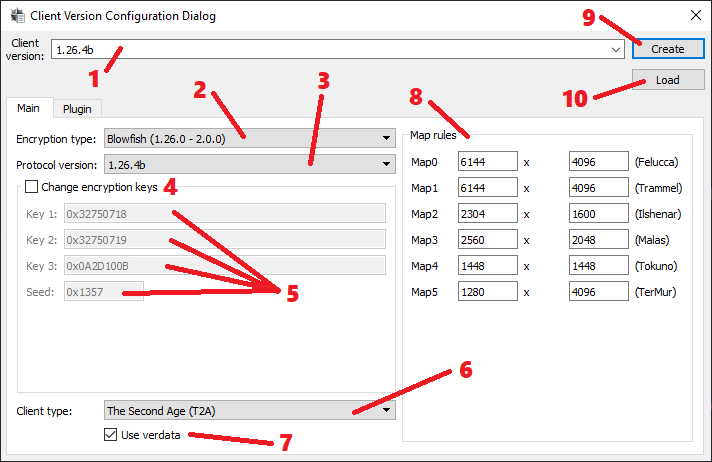

# Main - Extended Mode

1) Client version which'll be sent to your server. When you're typing a version number, configurator searches for matches and picks right encryption keys, stadart map sizes and verdata usage flag when there's a match. After you've entered your desirable client version, you can edit those values manually.

2) Client's encryption type.

    - `No Crypt` - No encryption.

    - `Old Blowfish (<1.25.36)` For truly ancient client versions only.

    - `Blowfish (1.25.36)` This version only encryption.

    - `Blowfish (1.26.0 - 2.0.0)` For client up to 2.0.0 versions (with the exception of the above one).

    - `Blowfish + Twofish (2.0.3)` For 2.0.0 - 2.0.3 clients.

    - `Twofish + MD5 (>2.0.3)` For clients above 2.0.3

3) Version of clients protocol. This toggles on/off different packet changes which EA's made over the years. This should correlate with client version.

4) Manual crypto key input. Use  this only if you have changed encryption keys on your server and you know what you're doing.

5) Text input for crypto keys.

6) Client type. At this moment this is only being sent the server when creating a character.

7) Toggle to make OrionUO read (Verdata.mul) and *.mul files only. If you're willing to use latest client versions which contain *.uop files, you need to toggle this off.

8) Map size.

9) Create `Client.cuo` file with current config. It will be created in `"UO files path"` folder.

10) Load `Client.cuo` config file.
