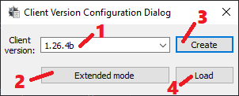

# CVC - Mini

1. Client version which'll be sent to your server.
2. `Extended mode` expand window with advanced stuffs like encryption, protocol version, encryption keys, etc...
3. Create `Client.cuo` file with current config. It will be created in `"UO files path"` folder.
4. Load `Client.cuo` config file.
