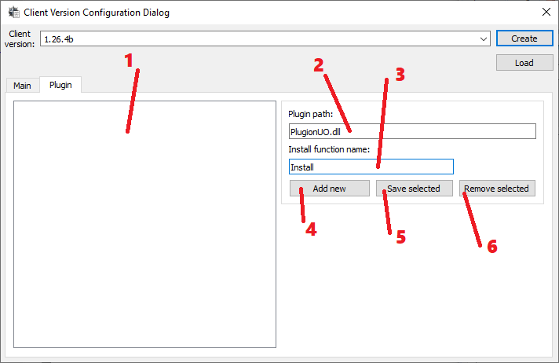

# CVC - Plugin - Extended Mode

1) List of enabled plug-ins.

2) Plug-in file name.

3) Main function from the dll to trigger the install.

4) `Create` plug-in with current config.

5) `Save` selected plug-ins config.

6) `Delete` selected plug-in.
