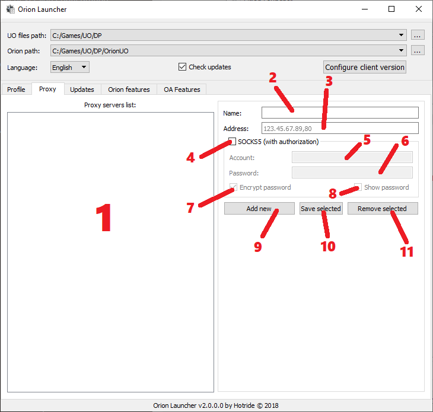

# Launcher - Proxy

1. `Proxy servers list` Press `Delete` for remove current selected proxy server.

2. `Name` Proxy server name (to display in proxy list).

3. `Address` Proxy server address and port. Entered in the format: **IP,Port** for example: `123.45.67.89,80`

4. `SOCKS5` - Use SOCKS5 proxy (with authorization).

5. `Account` - Account for authorization on the proxy server.

6. `Password` - Password for authorization on the proxy server.

7. `Encrypt password` - Enable account / password encryption.

8. `Show password` - display your password while enabled without mask.

9. `Add new` - Add a new proxy server with the entered data.

10. `Save selected` - Save selected proxy server.

11. `Remove selected` - Delete selected proxy server.
