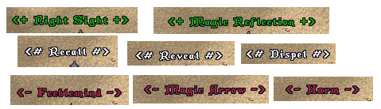

# Tips & Tricks


### Orion Assistant - Filters - Replaces


test1


test2


test3


test4


You can for example change all **Words of Power** with this feature [OA - Replaces](../assistant/filters-replaces-tab.md) to actual name of spell with some extra symbols and it's color like it's shown on image above.

If you want to download/import/export your replace settings it's located in your OrionUO folder
</br>
        `..\Ultima\OrionUO\OA\GlobalConfig`
</br>
file is named **TextReplaces.xml**
</br></br>
Here is already edited file to download which contains all spells sorted in **BENEFIT/NEUTRAL/HARMFUL** sections like on this image
</br></br>

**=>** [TextReplaces.xml - DOWNLOAD][cd5adc27] **<=**

[cd5adc27]: https://github.com/Tal-Dor/OrionUO-docs/blob/master/stuffs/TextReplaces.xml "TextReplaces.xml - DOWNLOAD"

</br>
***
### TreeHack Switch

```javascript
function TreeHack_Switch()
{
	if (Orion.OptionDrawStumps())
	{
		Orion.OptionDrawStumps(false);
	}
	else
	{
		Orion.OptionDrawStumps(true);
	}
}
```

</br>
***
### Orion Assistant - in-game Commands

Paste these commands ingame into chat.

command  | description  |
--|---|--
_attack | |
_blockmoving | |
_cast | |
_clearjournal | |
_click | |
_closeuo | |
_drop | |
_drophere | |
_emoteaction | |
_getstatus | |
_helpgump | |
_hide | |
_ignorereset | |
_info | |
_infogump | |
_infomenu | |
_infotile | |
_journalignorecase | |
_loadhotkeys | |
_morph | |
_moveitem | |
_playsound | |
_resend | |
_saveconfig | |
_savehotkeys | |
_setarm | |
_setdress | |
_setdressbag | |
_setlight | |
_setseason | |
_setweather | |
_showjournal | |
_terminate | |
_textclear | |
_textclose | |
_textopen | |
_textprint | |
_track | |
_unsetarm | |
_unsetdress | |
_unsetdressbag | |
_usefromground | |
_useobject | |
_useskill | |
_usetype | |
_warmode | |

</br>
***
